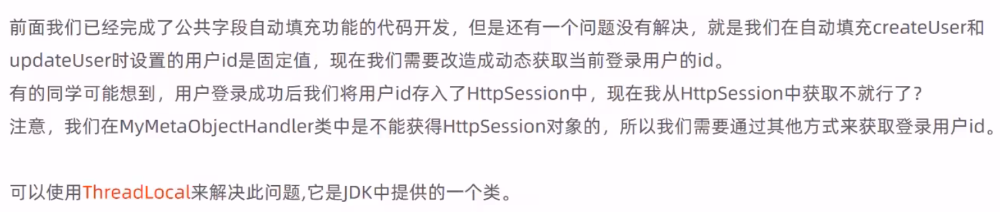
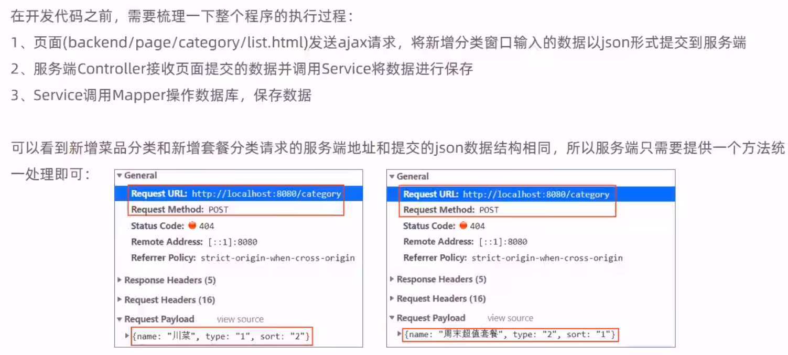

# 瑞吉外卖

## 目录

-   [开发Day1：后台登录功能](#开发Day1后台登录功能)
    -   [知识点1：泛型](#知识点1泛型)
        -   [泛型的命名约定](#泛型的命名约定)
    -   [知识点2：员工登录业务逻辑](#知识点2员工登录业务逻辑)
        -   [md5加密](#md5加密)
        -   [LambdaQueryWrapper   参考链接](#LambdaQueryWrapper---参考链接)
        -   [java8 :: （双冒号） 用法：](#java8--双冒号-用法)
    -   [知识点3：员工退出业务逻辑](#知识点3员工退出业务逻辑)
-   [开发Day2 :](#开发Day2-)
    -   [功能：添加员工](#功能添加员工)
    -   [异常处理：](#异常处理)
    -   [小结](#小结)
    -   [功能：员工信息分页查询](#功能员工信息分页查询)
    -   [功能：启用/禁用员工账号](#功能启用禁用员工账号)
        -   [对象转换器](#对象转换器)
    -   [功能：编辑员工信息](#功能编辑员工信息)
        -   [存在的问题：](#存在的问题)
-   [开发Day3：](#开发Day3)
    -   [功能：公共字段自动填充](#功能公共字段自动填充)
        -   [@TableField注解与MetaObjectHandle接口解决自动填充](#TableField注解与MetaObjectHandle接口解决自动填充)
        -   [ThreadLocal解决无法获取Session的问题：](#ThreadLocal解决无法获取Session的问题)
    -   [功能：新增分类&&分页信息查询](#功能新增分类分页信息查询)
    -   [功能：删除分类](#功能删除分类)
    -   [功能：修改分类](#功能修改分类)
-   [开发Day4：](#开发Day4)
    -   [功能：文件上传下载](#功能文件上传下载)
    -   [功能：新增菜品](#功能新增菜品)
        -   [导入DTO](#导入DTO)
        -   [@Transactional注解](#Transactional注解)
    -   [功能：菜品信息分页查询](#功能菜品信息分页查询)
    -   [功能：修改菜品](#功能修改菜品)
        -   [菜品信息回显（查询）：](#菜品信息回显查询)
        -   [菜品信息修改：](#菜品信息修改)
        -   [问题：](#问题)
    -   [作业：菜品（批量）起售/停售功能](#作业菜品批量起售停售功能)
        -   [注解：@PathVariable、@RequestParam用法：](#注解PathVariableRequestParam用法)
    -   [作业：删除、批量删除菜品](#作业删除批量删除菜品)
-   [开发Day5：](#开发Day5)
    -   [功能：新增套餐：](#功能新增套餐)
    -   [功能：套餐分页查询](#功能套餐分页查询)
    -   [功能：（批量）删除套餐](#功能批量删除套餐)
    -   [功能：手机验证码登录](#功能手机验证码登录)
        -   [发送验证码：](#发送验证码)
        -   [登录校验](#登录校验)
-   [开发Day6](#开发Day6)
    -   [功能：导入地址](#功能导入地址)
        -   [作业：补充功能：修改地址 、删除地址](#作业补充功能修改地址-删除地址)
    -   [功能：菜品展示](#功能菜品展示)
    -   [功能：购物车](#功能购物车)
        -   [添加商品到购物车](#添加商品到购物车)
        -   [查看/清空购物车](#查看清空购物车)
        -   [作业：补充功能：商品数量-1](#作业补充功能商品数量-1)
    -   [功能：用户下单：](#功能用户下单)
    -   [具体知识点：](#具体知识点)
        -   [· AtomicInteger ：](#-AtomicInteger-)
        -   [· IdWorker](#-IdWorker)
        -   [· addAndGet（）](#-addAndGet)
        -   [· saveBatch（）](#-saveBatch)

## 开发Day1：后台登录功能

### 知识点1：泛型

> 📌第一次见泛型类的使用。泛型在java基础中介绍过（泛型可以使类型在定义类、接口和方法的时侯成为参数，与方法中使用的形参非常相似，类型参数（泛型）提供了一种通过不同的输入而重用代码的方式。类型参数和形参的不同之处在于形参输入的是具体的值，而类型参数输入的是类型）。

#### 泛型的命名约定

按照约定，泛型的名称是单个的大写字母。这与变量的命名约定形成了鲜明的对比，如果没有这些约定，就很难区分类型变量和普通类或接口命名之间的区别。

泛型类，类型参数部分，用尖括号(<>)进行分隔，并跟在类名后面。它指定的类型参数为 T1，T2，…，和 Tn。

泛型方法的声明包括一个类型参数集 \<K，V>，该类型参数集位于尖括号内，出现在方法的返回类型之前。**对于静态泛型方法，强制要求类型参数必须出现在方法的返回类型之前**。

```java
package com.chaz.reggie.common;
import lombok.Data;
import java.util.HashMap;
import java.util.Map;

/**
 * @author chaz
 * @time 2023-05-29 17:34:19
 * @description 通用返回结果，服务端相应的数据最终都会封装成此对象
 */

@Data
public class R<T> {

    private Integer code; //编码：1成功，0和其它数字为失败

    private String msg; //错误信息

    private T data; //数据

    private Map map = new HashMap(); //动态数据

    public static <T> R<T> success(T object) {
        R<T> r = new R<T>();
        r.data = object;
        r.code = 1;
        return r;
    }

    public static <T> R<T> error(String msg) {
        R r = new R();
        r.msg = msg;
        r.code = 0;
        return r;
    }

    public R<T> add(String key, Object value) {
        this.map.put(key, value);
        return this;
    }
}
```

### 知识点2：员工登录业务逻辑

#### md5加密

*password = DigestUtils.md5DigestAsHex(password.getBytes());*

#### LambdaQueryWrapper   [参考链接](https://blog.csdn.net/weixin_54878983/article/details/130170438?spm=1001.2101.3001.6650.2\&utm_medium=distribute.pc_relevant.none-task-blog-2%7Edefault%7EYuanLiJiHua%7EPosition-2-130170438-blog-127916392.235%5Ev36%5Epc_relevant_default_base3\&depth_1-utm_source=distribute.pc_relevant.none-task-blog-2%7Edefault%7EYuanLiJiHua%7EPosition-2-130170438-blog-127916392.235%5Ev36%5Epc_relevant_default_base3\&utm_relevant_index=3 "参考链接")

**一句话定义**：通过**调用构造方法**返回一个LambdaQueryWrapper对象，在对象上使用链式编程、[Lambda表达式](https://so.csdn.net/so/search?q=Lambda表达式\&spm=1001.2101.3001.7020 "Lambda表达式")和链式调用的方式，灵活地**实现了SQL查询条件构造**和简化了SQL查询代码的编写。

**一个流程看懂**：

**创建**一个LambdaQueryWrapper对象 -> 使用Lambda表达式或方法引用**构造**查询条件 -> **调用**MyBatis-Plus提供的方法获取查询结果。


#### java8 :: （双冒号） 用法：

JDK8中有双冒号的用法，就是**把方法当做参数传到stream内部，使stream的每个元素都传入到该方法里面执行一下**。

```java
/**
     * @description 员工登录
     * @author chaz
     * @date 18:05 2023/5/29
     * @param request
     * @param employee
     * @return com.chaz.reggie.common.R<com.chaz.reggie.entity.Employee>
     */
    @PostMapping("/login")
    public R<Employee> login(HttpServletRequest request , @RequestBody Employee employee){
        //1、将页面提交的密码password进行md5加密处理
        String password = employee.getPassword();
        password = DigestUtils.md5DigestAsHex(password.getBytes());

        //2、根据页面提交的用户名username查询数据库
        LambdaQueryWrapper<Employee> queryWrapper=new LambdaQueryWrapper<>();
        queryWrapper.eq(Employee::getUsername,employee.getUsername());
        Employee emp=employeeService.getOne(queryWrapper);

        //3、如果没有查询到则返回登录失败结果
        if(emp == null){
            return R.error("登录失败");
        }

        //4、密码比对，如果不一致则返回登录失败结果
        if(!emp.getPassword().equals(password)){
            return R.error("登录失败");
        }

        //5、查看员工状态，如果为已禁用状态，则返回员工已禁用结果
        if(emp.getStatus() == 0){
            return R.error("账号已禁用");
        }

        //6、登录成功，将员工id存入Sess ion并返回登录成功结果
        request.getSession().setAttribute("employee",emp.getId());
        return R.success(emp);
    }
```

### 知识点3：员工退出业务逻辑

其实就是删除session中的员工数据， 并传递消息。

```java
/**
     * @description 员工退出
     * @author chaz
     * @date 20:05 2023/5/29
     * @param request 
     * @return com.chaz.reggie.common.R<java.lang.String>
     */
    @PostMapping("/logout")
    public R<String> logout(HttpServletRequest request){
        request.getSession().removeAttribute("employee");
        return R.success("退出成功");
    }
```

## 开发Day2 :

### 功能：添加员工


> 📌比较简单的业务写法。比较不理解的是关于注解的使用，什么时候需要加注解？

```java
/**
     * @description 新增员工
     * @author chaz
     * @date 11:41 2023/5/30
     * @param request
     * @param employee 
     * @return com.chaz.reggie.common.R<java.lang.String>
     */
    @PostMapping//这里后边不用写具体uri是因为前端post请求 就是只到employee，而本类开头已经写了@RequestMapping("/employee")
    public R<String> save(HttpServletRequest request,@RequestBody Employee employee){
        log.info("新增员工，员工信息：{}",employee.toString());

        //初始密码123456，需要md5加密
        employee.setPassword(DigestUtils.md5DigestAsHex("123456".getBytes()));

        employee.setCreateTime(LocalDateTime.now());
        employee.setUpdateTime(LocalDateTime.now());

        //获取当前用户id
        Long empId = (Long) request.getSession().getAttribute("employee");

        employee.setCreateUser(empId);
        employee.setUpdateUser(empId);

        employeeService.save(employee);
        return R.success("新增员工成功");
    }
```

### 异常处理：


首先，在common包中写出 **全局异常类**的框架：

```java
/**
 * @author chaz
 * @time 2023-05-30 11:50:26
 * @description 全局异常处理
 */
@ControllerAdvice(annotations = {RestController.class, Controller.class})
@ResponseBody
@Slf4j
public class GlobalExceptionHandler {
}
```

然后写 对应的 异常处理方法：

```java
/**
     * @description 异常处理方法
     * @author chaz
     * @date 14:52 2023/5/30
     * @param ex 
     * @return com.chaz.reggie.common.R<java.lang.String>
     */
    @ExceptionHandler(SQLIntegrityConstraintViolationException.class)
    public R<String> exceptionHandler(SQLIntegrityConstraintViolationException ex){
        log.error(ex.getMessage());

        if (ex.getMessage().contains("Duplicate entry")){
            String[] split = ex.getMessage().split(" ");
            String msg = split[2]+"已存在";
            return R.error(msg);
        }

        return R.error("未知错误");
    }
```

### 小结


### 功能：员工信息分页查询


> 📌分页查询这里的实现步骤其实和上边功能类似，但是不同的是要先写一下mybatis plus的配置。然后再到controller中写具体业务功能。

首先写MP配置类：

```java
package com.chaz.reggie.config;

import com.baomidou.mybatisplus.extension.plugins.MybatisPlusInterceptor;
import com.baomidou.mybatisplus.extension.plugins.inner.PaginationInnerInterceptor;
import org.springframework.context.annotation.Bean;
import org.springframework.context.annotation.Configuration;

/**
 * @author chaz
 * @time 2023-05-30 17:35:57
 * @description 配置MP的分页插件
 */
@Configuration
public class MybatisPlusConfig {

    @Bean
    public MybatisPlusInterceptor mybatisPlusInterceptor(){
        MybatisPlusInterceptor mybatisPlusInterceptor=new MybatisPlusInterceptor();
        mybatisPlusInterceptor.addInnerInterceptor(new PaginationInnerInterceptor());
        return mybatisPlusInterceptor;
    }
}
```

然后写前端Get对应的 方法

```java
/**
     * @description 员工信息分页查询
     * @author chaz
     * @date 17:40 2023/5/30
     * @param page
     * @param pageSize
     * @param name 
     * @return com.chaz.reggie.common.R<com.baomidou.mybatisplus.extension.plugins.pagination.Page>
     */
    @GetMapping("/page")
    public R<Page> page(int page,int pageSize,String name){
        log.info("page = {}, pageSize = {}, name={}",page,pageSize,name);

        //构造分页构造器
        Page pageInfo=new Page(page,pageSize);

        //构造条件构造器
        LambdaQueryWrapper<Employee> queryWrapper = new LambdaQueryWrapper();
        //添加过滤条件
        queryWrapper.like(StringUtils.isNotEmpty(name),Employee::getName,name);
        //添加排序条件
        queryWrapper.orderByDesc(Employee::getUpdateTime);

        //执行查询
        employeeService.page(pageInfo,queryWrapper); //执行后并不需要返回。因为mp已经把插叙难道的结果封装在page对象中

        return R.success(pageInfo);
    }
```

### 功能：启用/禁用员工账号


了解流程后，编写controller代码

```java
/**
     * @description 启用/禁用员工
     * @author chaz
     * @date 10:22 2023/6/2
     * @param employee
     * @return com.chaz.reggie.common.R<java.lang.String>
     */
    @PutMapping
    public R<String> update(HttpServletRequest request,@RequestBody Employee employee){
        log.info(employee.toString());

        employee.setUpdateTime(LocalDateTime.now());
        employee.setUpdateUser((Long)request.getSession().getAttribute("employee"));
        employeeService.updateById(employee);

        return R.success("员工信息修改成功");
    }
```

代码没有问题，但是执行后并不会修改成功，sql会报错找不到id。

原因：雪花算法生成的id过长，前端处理会精度丢失（只能16位）


解决办法：将long转为string


实现方法步骤：

#### 对象转换器


```java
/**
     * @description TODO the method is used to
     * @author chaz
     * @date 20:19 2023/6/2 
     * @param converters 
     */
    @Override
    protected void extendMessageConverters(List<HttpMessageConverter<?>> converters) {
        log.info("扩展消息转换器.....");
        //创建消息转换器对象
        MappingJackson2HttpMessageConverter messageConverter = new MappingJackson2HttpMessageConverter();
        //设置对象转换器，底层使用Jackson将Java对象转为json
        messageConverter.setObjectMapper(new JacksonObjectMapper());
        //将上面的消息转换器对象追加到mvc框架的转换器集合中
        converters.add(0,messageConverter);
    }
```

修改代码后，原功能执行成功。

### 功能：编辑员工信息


具体步骤：


```java
/**
     * @description 根据id查询员工信息。
     * @author chaz
     * @date 19:47 2023/6/2
     * @param id 
     * @return com.chaz.reggie.common.R<com.chaz.reggie.entity.Employee>
     */
    @GetMapping("/{id}")
    public R<Employee> getById(@PathVariable Long id){
        log.info("根据id查询员工信息");
        Employee employee = employeeService.getById(id);
        return R.success(employee);
    }
```

#### 存在的问题：

1.为什么不用写更新时间、类似的数据， 执行后自动就更新数据库了

答：因为直接复用了update方法，在前端修改完后，直接调用执行更新了。

2.restful是什么？

## 开发Day3：

### 功能：公共字段自动填充


&#x20;&#x20;

#### @TableField注解与MetaObjectHandle接口解决自动填充


#### ThreadLocal解决无法获取Session的问题：




1.新建BaseContext工具类：

```java
package com.chaz.reggie.common;

/**
 * @author chaz
 * @time 2023-06-02 21:37:49
 * @description 基于TreadLocal封装工具类，用户保存和获取当前登录用户的id
 */
public class BaseContext {
    private static ThreadLocal<Long> threadLocal = new ThreadLocal<>();

    /**
     * @description 设置值
     * @author chaz
     * @date 21:45 2023/6/2
     * @param id
     */
    public static void setCurrentId(Long id){
        threadLocal.set(id);
    }

    /**
     * @description 获取id值
     * @author chaz
     * @date 21:45 2023/6/2
     * @return java.lang.Long
     */
    public static  Long getCurrentId(){
        return threadLocal.get();
    }
}

```

2.在LoginCheckFilter的doFilter方法中获取当前用户id

```java
 Long empId = (Long) request.getSession().getAttribute("employee");
 BaseContext.setCurrentId(empId);
```

3\. 在MyMetaObjecthandler中调用工具类，获取id，并完成自动填充代码：

```java
    metaObject.setValue("createUser",BaseContext.getCurrentId());
    metaObject.setValue("updateUser",BaseContext.getCurrentId());
```

### 功能：新增分类&&分页信息查询


```java
@Mapper
public interface CategoryMapper extends BaseMapper<Category> {
}

public interface CategoryService extends IService<Category> {
}

@Service
public class CategoryServiceImpl extends ServiceImpl<CategoryMapper, Category> implements CategoryService {
}


```



具体业务代码如下， 和之前的功能如出一辙。  包括下面的分页功能也一样。

```java
/**
 * @author chaz
 * @time 2023-06-05 15:31:11
 * @description TODO
 */
@RestController
@RequestMapping("/category")
@Slf4j
public class CategoryController {

    @Autowired
    private CategoryService categoryService;

    /**
     * @description 新增分类
     * @author chaz
     * @date 16:12 2023/6/5
     * @param category 
     * @return com.chaz.reggie.common.R<java.lang.String>
     */
    @PostMapping
    public R<String> save(@RequestBody Category category){
        log.info("category:{}",category);
        categoryService.save(category);
        return R.success("新增分类成功");
    }

    /**
     * @description 分页查询
     * @author chaz
     * @date 16:15 2023/6/5
     * @param page
     * @param pageSize 
     * @return com.chaz.reggie.common.R<com.baomidou.mybatisplus.extension.plugins.pagination.Page>
     */
    @GetMapping("/page")
    public R<Page> page(int page,int pageSize){
        //分页构造器
        Page<Category> pageInfo = new Page<>(page,pageSize);
        //条件构造器
        LambdaQueryWrapper<Category> queryWrapper = new LambdaQueryWrapper<>();
        //添加排序条件，根据sort进行排序
        queryWrapper.orderByAsc(Category::getSort);

        //分页查询
        categoryService.page(pageInfo,queryWrapper);
        return R.success(pageInfo);
    }
}
```

### 功能：删除分类


简单实现（直接删除）

```java
@DeleteMapping
    public R<String> delete(Long id){
        log.info("删除分类，id为：{}" ,id);

        categoryService.removeById(id);
        return R.success("分类信息删除成功");
    }
```

直接删除是十分不合适的方法，因此要完善功能


代码如下：

```java
1. 实体类直接导入即可
2. 创建mapper 格式化，直接套就行
3. 创建Service接口， 格式化，直接套
4. 实现类


@Service
public class CategoryServiceImpl extends ServiceImpl<CategoryMapper, Category> implements CategoryService {

    @Autowired
    private DishService dishService;

    @Autowired
    private SetmealService setmealService;

    /**
     * @description 根据id删除分类，删除前进行判断
     * @author chaz
     * @date 17:17 2023/6/5
     * @param id
     */
    @Override
    public void remove(Long id){
        LambdaQueryWrapper<Dish> dishlambdaQueryWrapper=new LambdaQueryWrapper<>();
        //添加查询条件，根据分类id查询
        dishlambdaQueryWrapper.eq(Dish::getCategoryId,id);
        int count=dishService.count(dishlambdaQueryWrapper);

        //查询当前 分类是否有关联的菜品，如果关联，抛出异常
        if (count>0) {
            //已经关联菜品，需要抛出异常
            throw new CustomException("当前分类下关联了菜品，不能删除");
        }

        //查询当前 分类是否有关联的套餐，如果关联，抛出异常
        LambdaQueryWrapper<Setmeal> setmealLambdaQueryWrapper = new LambdaQueryWrapper<>();
        //添加查询条件，根据分类id查询
        setmealLambdaQueryWrapper.eq(Setmeal::getCategoryId,id);
        int count2=setmealService.count(setmealLambdaQueryWrapper);
        if (count2>0){
            //已经关联套餐，需要抛出异常
            throw new CustomException("当前分类下关联了套餐，不能删除");
        }

        //都没有，正常删除分类
        super.removeById(id);
    }
}

自定义异常类：
/**
 * @author chaz
 * @time 2023-06-05 19:16:31
 * @description 自定义业务异常类
 */
public class CustomException extends RuntimeException{
    public CustomException(String message){
        super(message);
    }
}

异常处理方法：
/**
     * @description 异常处理方法--删除分类
     * @author chaz
     * @date 14:52 2023/5/30
     * @param ex
     * @return com.chaz.reggie.common.R<java.lang.String>
     */
    @ExceptionHandler(CustomException.class)
    public R<String> exceptionHandler(CustomException ex){
        log.error(ex.getMessage());

        return R.error(ex.getMessage());
    }

```

### 功能：修改分类

老生常谈，过于简单，直接放代码：

```java
/**
     * @description 根据id更新分类信息
     * @author chaz
     * @date 20:02 2023/6/5
     * @param category
     * @return com.chaz.reggie.common.R<java.lang.String>
     */
    @PutMapping
    public R<String> update(@RequestBody Category category){
        log.info("修改分类信息：{}",category);

        categoryService.updateById(category);

        return R.success("修改分类信息成功");
    }
```

## 开发Day4：

### 功能：文件上传下载


服务端：


文件上传实现：

```java
/**
 * @author chaz
 * @time 2023-06-05 20:40:56
 * @description TODO
 */

@RestController
@RequestMapping("/common")
@Slf4j
public class CommonController {

    @Value("${reggie.path}")
    private String basePath;

    /**
     * @description 文件上传
     * @author chaz
     * @date 20:43 2023/6/5
     * @param file 
     * @return com.chaz.reggie.common.R<java.lang.String>
     */
    @PostMapping("/upload")
    public R<String> upload(MultipartFile file){ //此处形参名称不能随意命名，必须要和 前端请求表单中的name=“file” 的name一致
        log.info(file.toString());
        //原始文件名
        String originalFileName=file.getOriginalFilename();
        String suffix = originalFileName.substring(originalFileName.lastIndexOf("."));

        //使用UUID重新生成文件名，防止文件重名导致的文件覆盖
        String fileName = UUID.randomUUID().toString()+suffix;

        //创建一个目录
        File dir= new File(basePath);
        if (!dir.exists()) {
            //目录不存在时创建目录
            dir.mkdirs();
        }

        try {
            file.transferTo(new File(basePath+fileName));
        } catch (IOException e) {
            throw new RuntimeException(e);
        }
        return R.success(fileName);
    }
}
```

文件下载：前端发送请求，后端通过输入输出流 处理


```java
@GetMapping("/download")
    public void download(String name, HttpServletResponse response){

        try {
            //输入流，通过输入流读取文件内容
            FileInputStream fileInputStream = new FileInputStream(new File(basePath+name));
            //输出流，通过输出流将文件写会浏览器，在浏览器显示图片
            ServletOutputStream outputStream=response.getOutputStream();

            response.setContentType("image/jpeg");

            int len=0;
            byte[] bytes = new byte[1024];
            while((len = fileInputStream.read(bytes)) != -1){
                outputStream.write(bytes,0,len);
                outputStream.flush();
            }

            //关闭资源
            outputStream.close();
            fileInputStream.close();
        } catch (Exception e) {
            e.printStackTrace();
        }


    }
```

### 功能：新增菜品

准备工作：搭框架


1.菜品分类下拉框实现

```java
/**
     * @description 根据条件查询分类数据
     * @author chaz
     * @date 10:21 2023/6/6 
     * @param category 
     * @return com.chaz.reggie.common.R<java.util.List<com.chaz.reggie.entity.Category>>
     */
    @GetMapping("/list")
    public R<List<Category>> list(Category category){
        //条件构造器
        LambdaQueryWrapper<Category> queryWrapper=new LambdaQueryWrapper<>();
        //添加条件
        queryWrapper.eq(category.getType()!=null,Category::getType,category.getType());
        //添加排序条件
        queryWrapper.orderByAsc(Category::getSort).orderByAsc(Category::getUpdateTime);

        List<Category> list = categoryService.list(queryWrapper);
        return R.success(list);
    }
```

2.从前端获取dish、dishflavor数据：


前端传来的数据较为复杂，没有对应的实体类（Dish中没有flavor的数据），因此需要引入**DTO**

#### 导入DTO


3.导入dto后，可以开始写具体的Service代码：

```java
@Autowired
    private DishFlavorService dishFlavorService;

    /**
     * @description 新增菜品同时保存对于的口味数据
     * @author chaz
     * @date 10:48 2023/6/6
     * @param dishDto
     */
    @Override
    @Transactional
    public void saveWithFlavor(DishDto dishDto) {
        //保存菜品的基本信息到菜品表dish
        this.save(dishDto);

        Long dishId=dishDto.getId();//获取菜品id
        //菜品口味
        List<DishFlavor> flavors=dishDto.getFlavors();
        //将dishid赋值给每一个DsihFlavor  （.stream()是将集合转化为流,.map是将流中的元素计算或者转换(此处用map为流中的dishid赋值),.collect是将流转为集合）
        flavors = flavors.stream().map((item)->{
            item.setDishId(dishId);
            return item;
        }).collect(Collectors.toList());

        //保存菜品口味数据到菜品口味表dish_flavor
//        dishFlavorService.saveBatch(dishDto.getFlavors()); 这样写有问题，因为直接getFlavors()中的数据没有dishid
        dishFlavorService.saveBatch(flavors);
    }
  
 //Controller层比较简单：
 @PostMapping
    public R<String> save(@RequestBody DishDto dishDto){
        log.info(dishDto.toString());

        dishService.saveWithFlavor(dishDto);
        return R.success("新增菜品成功");
    }   
```

#### @**Transactional**注解

事务控制，保证数据的一致性

`@Transactional`是spring中声明式事务管理的注解配置方式，相信这个注解的作用大家都很清楚。`@Transactional`注解可以帮助我们把事务开启、提交或者回滚的操作，通过aop的方式进行管理。

通过`@Transactional`注解就能让spring为我们管理事务，免去了重复的事务管理逻辑，减少对业务代码的侵入，使我们开发人员能够专注于业务层面开发。

***@EnableTransactionManagement***

### 功能：菜品信息分页查询


传统写法：

```java
@GetMapping("/page")
    public R<Page> page(int page,int pageSize,String name){

        //构造分页构造器对象
        Page<Dish> pageInfo = new Page<>(page,pageSize);

        //条件构造器
        LambdaQueryWrapper<Dish> queryWrapper = new LambdaQueryWrapper<>();
        //添加过滤条件
        queryWrapper.like(name != null,Dish::getName,name);
        //添加排序条件
        queryWrapper.orderByDesc(Dish::getUpdateTime);

        //执行分页查询
        dishService.page(pageInfo,queryWrapper);

        return R.success(pageInfo);
    }
```

该方法并不符合要求，因为返回的是categoryid  而不是categoryname 因此前端显示不出来分类名称categoryname。

可以通过分页对象，改变其中的内容来达到展示 categoryname的目标：

```java
@GetMapping("/page")
    public R<Page> page(int page,int pageSize,String name){

        //构造分页构造器对象
        Page<Dish> pageInfo = new Page<>(page,pageSize);
        Page<DishDto> dishDtoPage=new Page<>();

        //条件构造器
        LambdaQueryWrapper<Dish> queryWrapper = new LambdaQueryWrapper<>();
        //添加过滤条件
        queryWrapper.like(name != null,Dish::getName,name);
        //添加排序条件
        queryWrapper.orderByDesc(Dish::getUpdateTime);

        //执行分页查询
        dishService.page(pageInfo,queryWrapper);

        BeanUtils.copyProperties(pageInfo,dishDtoPage,"records");

        List<Dish> records = pageInfo.getRecords();

        List<DishDto> list = records.stream().map((item) -> {
            DishDto dishDto = new DishDto();

            BeanUtils.copyProperties(item,dishDto);

            Long categoryId = item.getCategoryId();//分类id
            //根据id查询分类对象
            Category category = categoryService.getById(categoryId);

            if(category != null){
                String categoryName = category.getName();
                dishDto.setCategoryName(categoryName);
            }
            return dishDto;
        }).collect(Collectors.toList());

        dishDtoPage.setRecords(list);

        return R.success(dishDtoPage);
    }
```

### 功能：修改菜品

&#x20;


#### 菜品信息回显（查询）：

Controller层：

```java

/**
     * @description 根据id更新分类信息
     * @author chaz
     * @date 20:02 2023/6/5
     * @param category
     * @return com.chaz.reggie.common.R<java.lang.String>
     */
    @PutMapping
    public R<String> update(@RequestBody Category category){
        log.info("修改分类信息：{}",category);

        categoryService.updateById(category);

        return R.success("修改分类信息成功");
    }
```

Service层：

```java
/**
     * @description 根据id查询菜品信息和对应的口味信息
     * @author chaz
     * @date 10:24 2023/6/8
     * @param id
     * @return com.chaz.reggie.dto.DishDto
     */
    @Override
    public DishDto getByIdWithFlavor(Long id) {
        //查询菜品基本信息，从dish表查询
        Dish dish = this.getById(id);

        DishDto dishDto=new DishDto();
        BeanUtils.copyProperties(dish,dishDto);

        //查询当前菜品对应额度口味信息，从dish_flavor表查询
        LambdaQueryWrapper<DishFlavor> queryWrapper = new LambdaQueryWrapper<>();
        queryWrapper.eq(DishFlavor::getDishId,dish.getId());
        List<DishFlavor> flavors = dishFlavorService.list(queryWrapper);
        dishDto.setFlavors(flavors);

        return dishDto;
    }
```

#### 菜品信息修改：

Controller：

```java
/**
     * @description 修改菜品信息
     * @author chaz
     * @date 10:40 2023/6/8
     * @param dishDto
     * @return com.chaz.reggie.common.R<java.lang.String>
     */
    @PutMapping
    public R<String> update(@RequestBody DishDto dishDto){
        log.info(dishDto.toString());

        dishService.updateWithFlavor(dishDto);

        return R.success("修改菜品成功");
    }
```

Service层：

```java
/**
     * @description 更新菜品信息，同时更新口味信息
     * @author chaz
     * @date 10:41 2023/6/8
     * @param dishDto
     */
    @Override
    public void updateWithFlavor(DishDto dishDto) {
        //更新dish表基本信息
        this.updateById(dishDto);

        //清理房前菜品对应口味数据--dish_flavor表的delete操作
        LambdaQueryWrapper<DishFlavor> queryWrapper=new LambdaQueryWrapper<>();
        queryWrapper.eq(DishFlavor::getDishId,dishDto.getId());
        dishFlavorService.remove(queryWrapper);

        //添加当前提交过来的口味数据--dish_flavor表的insert操作
        List<DishFlavor> flavors = dishDto.getFlavors();
        flavors = flavors.stream().map((item)->{
            item.setDishId(dishDto.getId());
            return item;
        }).collect(Collectors.toList());

        dishFlavorService.saveBatch(flavors);
    }
```

#### 问题：

这里其实有一个小bug，就是删除flavor 表中的口味数据，会把创建时间也给删除了，再添加的时候也就无法获取删除时间，而是直接创建新一条数据，因此其实如果口味数据没改的话，是被莫名其妙修改了创建时间的。 但是前端用户看不到，不影响使用，但是我认为是有问题的。

### 作业：菜品（批量）起售/停售功能

前端请求如下：


起售、停售 以及批量起售、停售 用的是同一个方法。 因此只需要按照批量的来 编写代码即可。 还是老套路。需要注意的是注解的相关问题。

```java
/**
     * @description 起售、停售以及 批量起售、停售
     * @author chaz
     * @date 17:53 2023/6/8
     * @param status
     * @param id
     * @return com.chaz.reggie.common.R<java.lang.String>
     */
    @PostMapping("/status/{status}")
    public R<String> status(@PathVariable Integer status, @RequestParam Long[] id){
        log.info("当前状态：{}，当前id：{}",status,id);

        for(int i=0;i<id.length;i++)
        {
            Dish dish = dishService.getById(id[i]);
            if (dish!=null){
                dish.setStatus(status);
                dishService.updateById(dish);
            }
        }
        return R.success("商品状态修改成功");
    }
    
        //更好一点的写法
@PostMapping("/status/{status}")
public Result<String> status(@PathVariable Integer status, @RequestParam List<Long> ids) {
    log.info("status:{},ids:{}", status, ids);
    LambdaUpdateWrapper<Dish> updateWrapper = new LambdaUpdateWrapper<>();
    updateWrapper.in(ids != null, Dish::getId, ids);
    updateWrapper.set(Dish::getStatus, status);
    dishService.update(updateWrapper);
    return Result.success("批量操作成功");
}
```

#### 注解：**@PathVariable**、**@RequestParam**用法：

### 作业：删除、批量删除菜品


删除这里涉及一个真假删除的问题，按理说应该是逻辑删除，但是因为前边的很多页面展示都没有考虑isdelete字段，因此这里偷懒直接真删除了。代码如下

```java
@DeleteMapping
    public R<String> delete(@RequestParam Long[] id){
        log.info("删除菜品，id为：{}" ,id);

        //假删除，问题：前端依旧显示
//        //根据id拿到 dishDto对象
//        DishDto dishDto = dishService.getByIdWithFlavor(id);
//        dishDto.setIsDeleted(1);
//        dishService.updateById(dishDto);

        //真删除，问题：真删除的话isdelete有啥用？
        for(long i : id){
            dishService.removeById(i);
        }
        return R.success("菜品删除成功");
    }

```

这样其实也还是不合理，因为在售状态的菜品不应该能删除，因此有下面更合适的代码：

```java
@DeleteMapping
    public R<String> delete(@RequestParam Long[] id){
        log.info("删除菜品，id为：{}" ,id);

        LambdaQueryWrapper<Dish> queryWrapper = new LambdaQueryWrapper<>();
        queryWrapper.in(Dish::getId, id);
        List<Dish> dishes = dishService.list(queryWrapper);
        for (Dish dish : dishes) {
            if (dish.getStatus() == 1) {
                throw new CustomException("删除列表中存在启售状态商品，无法删除");
            }
        }
        dishService.remove(queryWrapper);
        return R.success("删除成功");
    }
```

## 开发Day5：

### 功能：新增套餐：


老流程，搭建框架，代码略；


&#x20;1.和2. 复用了前边的代码

1.  展示菜品分类数据：


实现代码比较简单，基本的查询操作：

```java
@GetMapping("/list")
    public R<List<Dish>> list(Dish dish){

        //构造查询条件
        LambdaQueryWrapper<Dish> queryWrapper = new LambdaQueryWrapper<>();
        queryWrapper.eq(dish.getCategoryId()!=null,Dish::getCategoryId, dish.getCategoryId());
        //只查在售的，过滤掉停售的（状态为0的）
        queryWrapper.eq(Dish::getStatus,1);

        //添加排序条件
        queryWrapper.orderByAsc(Dish::getSort).orderByAsc(Dish::getUpdateTime);

        List<Dish> list = dishService.list(queryWrapper);

        return R.success(list);
    }
```

4 5 在前面已经实现过了

1.  Service层：

```java
@Override
    public void saveWithDish(SetmealDto setmealDto) {
        //保存套餐的基本信息，操作setmeal，执行insert操作
        this.save(setmealDto);

        List<SetmealDish> setmealDishes = setmealDto.getSetmealDishes();
        setmealDishes.stream().map((item) ->{
            item.setSetmealId(setmealDto.getId());
            return item;
        }).collect(Collectors.toList());

        //保存套餐和菜品的关联信息，操作setmeal_dish，执行insert操作
        setmealDishService.saveBatch(setmealDishes);
    }
```

Controlle层：

```java
@PostMapping
    public R<String> save(@RequestBody SetmealDto setmealDto){
        log.info("套餐信息：{}",setmealDto);

        setmealService.saveWithDish(setmealDto);

        return R.success("新增套餐成功");
    }

```

### 功能：套餐分页查询


本部分和day4的分页查询 基本一模一样：

```java
@GetMapping("/page")
    public R<Page> page(int page,int pageSize,String name){
        //分页构造器
        Page<Setmeal> pageInfo = new Page<>(page,pageSize);
        Page<SetmealDto> dtoPage=new Page<>();

        LambdaQueryWrapper<Setmeal> queryWrapper = new LambdaQueryWrapper<>();
        //添加查询条件，根据name进行like模糊查询
        queryWrapper.like(name!=null,Setmeal::getName,name);
        //添加排序条件，根据更新时间降序排列
        queryWrapper.orderByDesc(Setmeal::getUpdateTime);

        setmealService.page(pageInfo,queryWrapper);

        //对象拷贝
        BeanUtils.copyProperties(pageInfo,dtoPage,"records");
        List<Setmeal> records=pageInfo.getRecords();

        List<SetmealDto> list = records.stream().map((item)->{
            SetmealDto setmealDto = new SetmealDto();
            //对象拷贝
            BeanUtils.copyProperties(item,setmealDto);
            //分类id
            Long categoryId=item.getCategoryId();
            //根据分类id查询分类对象
            Category category = categoryService.getById(categoryId);
            if (category!=null){
                //分类名称
                String categoryName = category.getName();
                setmealDto.setCategoryName(categoryName);
            }
            return setmealDto;
        }).collect(Collectors.toList());

        dtoPage.setRecords(list);
        return R.success(dtoPage);
    }
```

### 功能：（批量）删除套餐


基本也是老生常谈的内容，只需要注意删除时候要把 套餐和菜品的关联信息也同时删除了。

Service层：

```java
@Transactional
    @Override
    public void removeWithDish(List<Long> ids) {
        //select count(*) from setmeal where id in (1,2,3) and status = 1
        //查询套餐状态，缺点是否可以删除
        LambdaQueryWrapper<Setmeal> queryWrapper = new LambdaQueryWrapper<>();
        queryWrapper.in(Setmeal::getId,ids);
        queryWrapper.eq(Setmeal::getStatus,1);

        int count = this.count(queryWrapper);
        if ((count)>0){
            //如果不能删除，抛出业务异常
            throw new CustomException("套餐正在售卖中，不能删除");
        }

        //如果可以删除，先删除套餐表中的数据--setmeal
        this.removeByIds(ids);

        //delete from setmeal_dish where setmeal_id in (1,2,3)
        LambdaQueryWrapper<SetmealDish> lambdaQueryWrapper = new LambdaQueryWrapper<>();
        lambdaQueryWrapper.in(SetmealDish::getSetmealId,ids);
        //删除关系表中的数据--setmeal_dish
        setmealDishService.remove(lambdaQueryWrapper);
    }
```

controller层：

```java
public R<String> delete(@RequestParam List<Long> ids){
        log.info("删除菜品，id为：{}" ,ids);
        setmealService.removeWithDish(ids);
        return R.success("套餐数据删除成功");
    }
```

### 功能：手机验证码登录


和前边一样，机械性的搭建框架。

#### 发送验证码：


后端生成验证码，然后用阿里云服务发送该验证码到手机，客户获取验证码后输入。

```java
@PostMapping("/sendMsg")
    public R<String> sendMsg(@RequestBody User user, HttpSession session){
        //获取手机号
        String phone=user.getPhone();

        if (StringUtils.isNotEmpty(phone)){
            //生成随机4位验证码
            String code = ValidateCodeUtils.generateValidateCode(4).toString();
            log.info("phone={} , code={}",phone,code);

            //调用阿里云短信服务api完成发送短信
            SMSUtils.sendMessage("工大外卖奶茶","SMS_279950017",phone,code);

            //需要将生成的验证码保存到session
            session.setAttribute(phone,code);

            return R.success("手机短信验证码发送成功");
        }
        return R.error("手机短信验证码发送失败");
    }
```

#### 登录校验


```java
@PostMapping("/login")
    public R<User> login(@RequestBody Map map, HttpSession session){
        log.info(map.toString());

        //获取手机号
        String phone= map.get("phone").toString();

        //获取验证码
        String code=map.get("code").toString();

        //从Session中获取保存的验证码
        Object codeInsession = session.getAttribute(phone);

        //进行验证码比对（页面提交的验证码和Session中保存的验证码比对）
        if (codeInsession!=null&&codeInsession.equals(code)){
            //如果比对成功，说明登录成功

            LambdaQueryWrapper<User> queryWrapper = new LambdaQueryWrapper<>();
            queryWrapper.eq(User::getPhone,phone);

            User user = userService.getOne(queryWrapper);
            if (user == null){
                //判断当前手机号对应的用户是否为新用户，如果是新用户就自动完成注册
                user = new User();
                user.setPhone(phone);
                user.setStatus(1);
                userService.save(user);
            }
            session.setAttribute("user",user.getId());
            return R.success(user);
        }

        return R.error("登陆失败");
    }
```

## 开发Day6

### 功能：导入地址


搭框架： 略&#x20;

具体代码功能开发：

```java
/**
     * 新增
     */
    @PostMapping
    public R<AddressBook> save(@RequestBody AddressBook addressBook) {
        addressBook.setUserId(BaseContext.getCurrentId());
        log.info("addressBook:{}", addressBook);
        addressBookService.save(addressBook);
        return R.success(addressBook);
    }

    /**
     * 设置默认地址
     */
    @PutMapping("default")
    public R<AddressBook> setDefault(@RequestBody AddressBook addressBook) {
        log.info("addressBook:{}", addressBook);
        LambdaUpdateWrapper<AddressBook> wrapper = new LambdaUpdateWrapper<>();
        wrapper.eq(AddressBook::getUserId, BaseContext.getCurrentId());
        wrapper.set(AddressBook::getIsDefault, 0);
        //SQL:update address_book set is_default = 0 where user_id = ?
        addressBookService.update(wrapper);

        addressBook.setIsDefault(1);
        //SQL:update address_book set is_default = 1 where id = ?
        addressBookService.updateById(addressBook);
        return R.success(addressBook);
    }

    /**
     * 根据id查询地址
     */
    @GetMapping("/{id}")
    public R get(@PathVariable Long id) {
        AddressBook addressBook = addressBookService.getById(id);
        if (addressBook != null) {
            return R.success(addressBook);
        } else {
            return R.error("没有找到该对象");
        }
    }

    /**
     * 查询默认地址
     */
    @GetMapping("default")
    public R<AddressBook> getDefault() {
        LambdaQueryWrapper<AddressBook> queryWrapper = new LambdaQueryWrapper<>();
        queryWrapper.eq(AddressBook::getUserId, BaseContext.getCurrentId());
        queryWrapper.eq(AddressBook::getIsDefault, 1);

        //SQL:select * from address_book where user_id = ? and is_default = 1
        AddressBook addressBook = addressBookService.getOne(queryWrapper);

        if (null == addressBook) {
            return R.error("没有找到该对象");
        } else {
            return R.success(addressBook);
        }
    }

    /**
     * 查询指定用户的全部地址
     */
    @GetMapping("/list")
    public R<List<AddressBook>> list(AddressBook addressBook) {
        addressBook.setUserId(BaseContext.getCurrentId());
        log.info("addressBook:{}", addressBook);

        //条件构造器
        LambdaQueryWrapper<AddressBook> queryWrapper = new LambdaQueryWrapper<>();
        queryWrapper.eq(null != addressBook.getUserId(), AddressBook::getUserId, addressBook.getUserId());
        queryWrapper.orderByDesc(AddressBook::getUpdateTime);

        //SQL:select * from address_book where user_id = ? order by update_time desc
        return R.success(addressBookService.list(queryWrapper));
    }
```

#### 作业：补充功能：修改地址 、删除地址

```java
/**
     * @description 补充功能：修改地址信息
     */
    @PutMapping
    public R<String> update(@RequestBody AddressBook addressBook){
        log.info("addressBook: {}",addressBook.toString());
        addressBookService.updateById(addressBook);
        return R.success("地址修改成功");
    }

    /**
     * @description 补充功能：删除地址
     */
    @DeleteMapping
    public R<String> delete(@RequestParam Long ids){
        log.info("删除地址，id= {}",ids);
        addressBookService.removeById(ids);
        return  R.success("删除地址成功");
    }
```

### 功能：菜品展示


这里其实就是对之前方法的一些完善或补充：

```java

//展示分类下的菜品数据
@GetMapping("/list")
    public R<List<DishDto>> list(Dish dish){
        //构造查询条件
        LambdaQueryWrapper<Dish> queryWrapper = new LambdaQueryWrapper<>();
        queryWrapper.eq(dish.getCategoryId()!=null,Dish::getCategoryId, dish.getCategoryId());
        //只查在售的，过滤掉停售的（状态为0的）
        queryWrapper.eq(Dish::getStatus,1);
        //添加排序条件
        queryWrapper.orderByAsc(Dish::getSort).orderByAsc(Dish::getUpdateTime);

        List<Dish> list = dishService.list(queryWrapper);

        List<DishDto> dishDtolist = list.stream().map((item) -> {
            DishDto dishDto = new DishDto();

            BeanUtils.copyProperties(item,dishDto);

            Long categoryId = item.getCategoryId();//分类id
            //根据id查询分类对象
            Category category = categoryService.getById(categoryId);

            if(category != null){
                String categoryName = category.getName();
                dishDto.setCategoryName(categoryName);
            }

            //当前菜品的id
            Long dishId = item.getId();
            LambdaQueryWrapper<DishFlavor> lambdaQueryWrapper=new LambdaQueryWrapper<>();
            lambdaQueryWrapper.eq(DishFlavor::getDishId,dishId);
            //SQL:select * from dish_flavor where dish_id = ?
            List<DishFlavor> dishFlavorList = dishFlavorService.list(lambdaQueryWrapper);
            dishDto.setFlavors(dishFlavorList);
            return dishDto;
        }).collect(Collectors.toList());

        return R.success(dishDtolist);
    }
```

展示套餐分类下的 套餐数据

```java
/**
     * @description 展示套餐分类下的 套餐数据
     * @author chaz
     * @date 16:12 2023/6/12
     * @param setmeal
     * @return com.chaz.reggie.common.R<java.util.List<com.chaz.reggie.entity.Setmeal>>
     */
    @GetMapping("/list")
    public R<List<Setmeal>> list(Setmeal setmeal){
        LambdaQueryWrapper<Setmeal> queryWrapper=new LambdaQueryWrapper<>();
        queryWrapper.eq(setmeal.getCategoryId()!=null,Setmeal::getCategoryId,setmeal.getCategoryId());
        queryWrapper.eq(setmeal.getStatus()!=null,Setmeal::getStatus,setmeal.getStatus());
        queryWrapper.orderByDesc(Setmeal::getUpdateTime);

        List<Setmeal> list = setmealService.list(queryWrapper);
        return R.success(list);
    }
```

&#x20;&#x20;

### 功能：购物车


框架搭建。略


#### 添加商品到购物车

```java
@PostMapping("/add")
    public R<ShoppingCart> add(@RequestBody ShoppingCart shoppingCart){
        log.info("购物车数据:{}",shoppingCart);

        //设置用户id，指定当前是哪个用户的购物车数据
        Long currentId = BaseContext.getCurrentId();
        shoppingCart.setUserId(currentId);

        //查询当前菜品是否已经在购物车中
        Long dishId = shoppingCart.getDishId();

        LambdaQueryWrapper<ShoppingCart> queryWrapper = new LambdaQueryWrapper<>();
        queryWrapper.eq(ShoppingCart::getUserId,currentId);

        if (dishId != null){
            //添加到购物车的是菜品
            queryWrapper.eq(ShoppingCart::getDishId,dishId);
        }
        else{
            //添加到购物车的是套餐
            queryWrapper.eq(ShoppingCart::getSetmealId,shoppingCart.getSetmealId());
        }

        //SQL:select * from shopping_cart where user_id = ? and dish_id/setmeal_id = ?
        ShoppingCart cartServiceOne = shoppingCartService.getOne(queryWrapper);

        if (cartServiceOne!=null){
            //如果已经存在，就在原来数量基础上+1
            Integer number = cartServiceOne.getNumber();
            cartServiceOne.setNumber(number+1);
            shoppingCartService.updateById(cartServiceOne);
        }
        else {
            //如果不存在，添加菜品到购物车，数量默认为1
            shoppingCart.setNumber(1);
            shoppingCartService.save(shoppingCart);
            cartServiceOne = shoppingCart;
        }
        return R.success(cartServiceOne);
    }
```

#### 查看/清空购物车

非常简单

```java
 @GetMapping("/list")
    public R<List<ShoppingCart>> list(){
        log.info("查看购物车");
        LambdaQueryWrapper<ShoppingCart> queryWrapper=new LambdaQueryWrapper<>();
        queryWrapper.eq(ShoppingCart::getUserId,BaseContext.getCurrentId());
        queryWrapper.orderByAsc(ShoppingCart::getCreateTime);
        List<ShoppingCart> list = shoppingCartService.list(queryWrapper);
        return R.success(list);
    }
    
@DeleteMapping("/clean")
    public R<String> clean(){
        log.info("清空购物车");
        //SQL:delete from shopping_cart where user_id = ?
        LambdaQueryWrapper<ShoppingCart> queryWrapper=new LambdaQueryWrapper<>();
        queryWrapper.eq(ShoppingCart::getUserId,BaseContext.getCurrentId());
        shoppingCartService.remove(queryWrapper);
        return R.success("已清空购物车");
    }

```

#### 作业：补充功能：商品数量-1

需要注意-1为0的话，直接删除本条

```java
@PostMapping("/sub")
    public R<ShoppingCart> sub(@RequestBody ShoppingCart shoppingCart){
        log.info("对应id的商品数量-1，id = {}",shoppingCart.getDishId());
        LambdaQueryWrapper<ShoppingCart> queryWrapper=new LambdaQueryWrapper<>();
        //确定是 菜品 还是套餐
        if (shoppingCart.getDishId()!=null){
            //如果是菜品，根据菜品id 找到对应的数据
            queryWrapper.eq(ShoppingCart::getDishId,shoppingCart.getDishId());
        }
        else {
            //如果是套餐，根据套餐id 找数据
            queryWrapper.eq(ShoppingCart::getSetmealId,shoppingCart.getSetmealId());
        }
        ShoppingCart cartServiceOne = shoppingCartService.getOne(queryWrapper);
        //找到数据后，判断数量是否==1
        if (cartServiceOne.getNumber()==1){
            //如果==1，直接删除本条
            shoppingCartService.removeById(cartServiceOne);
        }
        else {
            //否则，在该数据基础上-1 更新即可。
            cartServiceOne.setNumber(cartServiceOne.getNumber()-1);
            shoppingCartService.updateById(cartServiceOne);
        }
        return R.success(cartServiceOne);
    }
```

### 功能：用户下单：


1-3均在前边已经完成，只需要完成第4条功能


经典搭架子


搭完框架写具体代码。（略繁琐）

```java
Service层：
    @Autowired
    private ShoppingCartService shoppingCartService;
    @Autowired
    private UserService userService;
    @Autowired
    private AddressBookService addressBookService;
    @Autowired
    private OrderDetailService orderDetailService;

    @Override
    public void submit(Orders orders) {
        //获得当前用户id
        Long userId= BaseContext.getCurrentId();

        //查询当前用户的购物车数据
        LambdaQueryWrapper<ShoppingCart> queryWrapper=new LambdaQueryWrapper<>();
        queryWrapper.eq(ShoppingCart::getId,userId);
        List<ShoppingCart> shoppingCarts = shoppingCartService.list(queryWrapper);

        if (shoppingCarts==null||shoppingCarts.size()==0){
            throw new CustomException("购物车为空，不能下单");
        }
        //查询用户数据
        User user = userService.getById(userId);
        //查询地址数据
        Long addressBookId = orders.getAddressBookId();
        AddressBook addressBook = addressBookService.getById(addressBookId);
        if (addressBook==null){
            throw new CustomException("地址有误，不能下单");
        }
        
        long orderId = IdWorker.getId();//订单号

        AtomicInteger amount = new AtomicInteger(0);//原子操作，多线程情况下保证线程安全

        List<OrderDetail> orderDetails =shoppingCarts.stream().map((item) ->{
            OrderDetail orderDetail = new OrderDetail();
            orderDetail.setOrderId(orderId);
            orderDetail.setNumber(item.getNumber());
            orderDetail.setDishFlavor(item.getDishFlavor());
            orderDetail.setDishId(item.getDishId());
            orderDetail.setSetmealId(item.getSetmealId());
            orderDetail.setName(item.getName());
            orderDetail.setImage(item.getImage());
            orderDetail.setAmount(item.getAmount());
            amount.addAndGet(item.getAmount().multiply(new BigDecimal(item.getNumber())).intValue());//累加金额
            return orderDetail;
        }).collect(Collectors.toList());


        // 向订单表插入数据，一条数据
        orders.setId(orderId);
        orders.setOrderTime(LocalDateTime.now());
        orders.setCheckoutTime(LocalDateTime.now());
        orders.setStatus(2);
        orders.setAmount(new BigDecimal(amount.get()));//总金额
        orders.setUserId(userId);
        orders.setNumber(String.valueOf(orderId));
        orders.setUserName(user.getName());
        orders.setConsignee(addressBook.getConsignee());
        orders.setPhone(addressBook.getPhone());
        orders.setAddress((addressBook.getProvinceName() == null ? "" : addressBook.getProvinceName())
                + (addressBook.getCityName() == null ? "" : addressBook.getCityName())
                + (addressBook.getDistrictName() == null ? "" : addressBook.getDistrictName())
                + (addressBook.getDetail() == null ? "" : addressBook.getDetail()));
        //向订单表插入数据，一条数据
        this.save(orders);

        //向订单明细表插入数据，多条数据
        orderDetailService.saveBatch(orderDetails);

        //清空购物车数据。
        shoppingCartService.remove(queryWrapper);
    }
    
 Controller层：
    @PostMapping("/submit")
    public R<String> submit(@RequestBody Orders orders){
        log.info("订单数据：{}",orders);
        orderService.submit(orders);
        return R.success("下单成功");
    }
```

### 具体知识点：

#### **· AtomicInteger ：**

*AtomicInteger amount = new AtomicInteger(0);*//**原子操作，多线程情况下保证线程安全**

#### · **IdWorker**

idworker 是一个基于zookeeper和snowflake算法的**分布式统一ID生成工具**。

通过zookeeper自动注册机器（最多1024台），无需手动指定workerId和dataCenterId。
通过ZooKeeper持久顺序节点特性，来配置维护节点的编号NODEID。
集群节点命名服务的基本流程是：
（1）启动节点服务，连接ZooKeeper， 检查命名服务根节点根节点是否存在，如果不存在就创建系统根节点。
（2）在根节点下创建一个临时顺序节点，取回顺序号做节点的NODEID。如何临时节点太多，可以根据需要，删除临时节点。

由于是采用zookeeper顺序节点的特性生成datacenterId和workerId，可以天然的保证datacenterId和workerId的唯一性，减少了人工维护的弊端。

#### · addAndGet（）

分析其中的addAndGet方法，其源码如下

```java
public final int addAndGet(int delta) {
  return unsafe.getAndAddInt(this, valueOffset, delta) + delta;
}
```

发现它是调用unsafe包的方法，首先对传给unsafe的getAnddAddInt的参数进行说明：

-   this指当前的AtomicInteger对象
-   valueOffset由AtmoicInteger类中的静态代码块确定，指的是AtomicInteger的value属性在内存中的偏移量
-   delta即要value值要改变的大小

#### · **saveBatch**（）

```java
// 插入一条记录（选择字段，策略插入）
boolean save(T entity);
// 插入（批量）
boolean saveBatch(Collection<T> entityList);
// 插入（批量）
boolean saveBatch(Collection<T> entityList, int batchSize);//batchSize插入批次数量
```
